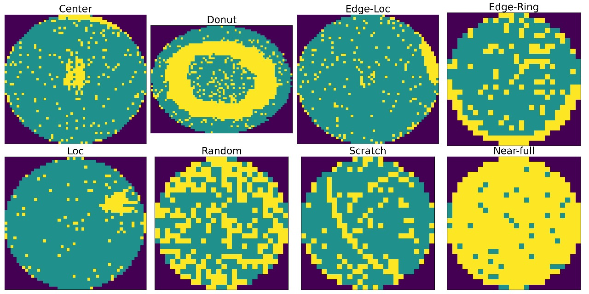
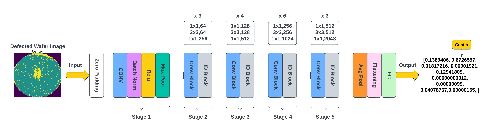
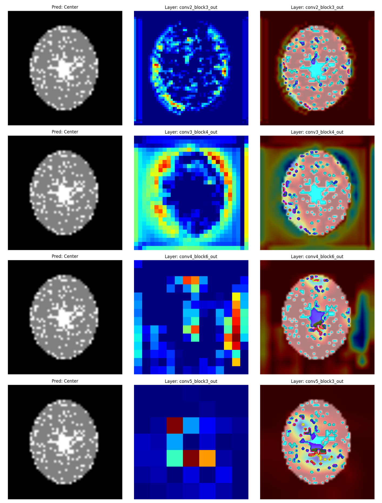
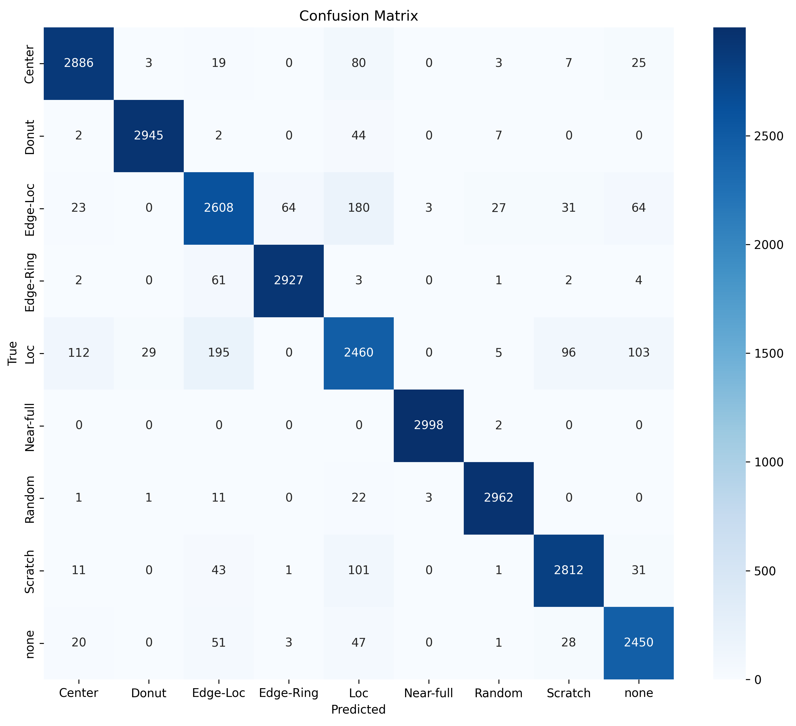
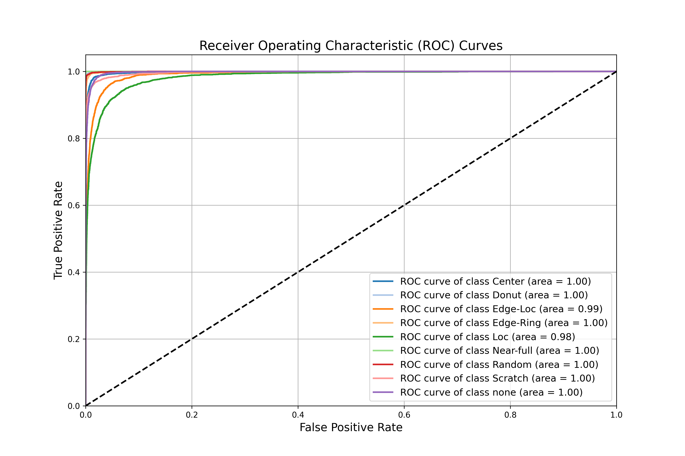

# Advancing Semiconductor Fabrication: A CNN-Based Wafer Defect Detection with XAI Insights

[](https://ieeexplore.ieee.org/abstract/document/11013292)
[](https://doi.org/10.1109/ECCE64574.2025.11013292)
[](https://ieeexplore.ieee.org/xpl/conhome/11012671/proceeding)
[](https://www.python.org/)
[](https://www.tensorflow.org/)
[](LICENSE)

> Official implementation and artifacts for the research paper:  
> **"Advancing Semiconductor Fabrication: A CNN-Based Wafer Defect Detection with XAI Insights"**  
> Published at the **2025 International Conference on Electrical, Computer and Communication Engineering (ECCE)**, IEEE.

---

## ⚡ At a Glance (30-Second Executive Summary)

Modern semiconductor fabrication involves over **1,000 intricate processing steps** across **10+ weeks**. When anomalies occur, manual wafer inspection by yield engineers attains **under 45% accuracy** due to fatigue, subjective bias, and extreme pattern complexity.

This repository presents an automated, production-oriented deep learning framework that classifies wafer defect signatures across the benchmark **WM-811K dataset (811,457 wafer maps)** and interprets predictions via **Explainable AI (Grad-CAM)**:

* **Top Classification Performance**: Our fine-tuned **ResNet50** achieves **94.08% overall accuracy** (outperforming Inception-v3 at 88.16%, Custom CNN at 86.21%, and SVM at 82.30%).
* **Extreme Defect Recognition**: Attains **99.93% accuracy** on critical *Near-full* defects and **99.53%** on *Donut* patterns.
* **Explainability (XAI)**: Overcomes the "black-box" barrier in semiconductor manufacturing by generating layer-wise **Grad-CAM heatmaps**, pinpointing the exact spatial clusters driving model classifications.
* **End-to-End Pipeline**: Includes full data preprocessing (morphological thinning, aspect-ratio standardization), imbalance-aware augmentation, training workflows, and a ready-to-use inference script.

```
Input Wafer Map ──► Preprocessing & Normalization ──► ResNet50 Classifier ──► Defect Class (94.08% Acc)
                                                                 │
                                                                 └──► Grad-CAM XAI Heatmap Sourcing
```

---

## 📸 Visual Overview

### 1. Wafer Defect Taxonomy (WM-811K Benchmark)
The system reliably classifies the 9 canonical wafer map patterns encountered in industrial fab lines:

<p align="center">
  
</p>

### 2. End-to-End Deep Learning Architecture
Our fine-tuned ResNet50 network combines residual representation extraction with a tailored classification head:

<p align="center">
  
</p>

### 3. Explainable AI: Layer-Wise Grad-CAM Visualizations
To build trust with yield engineers, Grad-CAM confirms that the model focuses on physical defect signatures rather than peripheral sensor noise:

<p align="center">
  
</p>

---

## 📊 Experimental Results

### Model Benchmark Comparison
Comprehensive evaluation on the held-out test distribution against alternative deep learning and machine learning architectures:

| Classifier Architecture | Test Accuracy | Precision (Macro) | Recall (Macro) | F1-Score (Macro) | Interpretability (XAI) |
| :--- | :---: | :---: | :---: | :---: | :---: |
| **ResNet50 (Proposed)** | **94.08%** | **0.9403** | **0.9409** | **0.9405** | **Layer-wise Grad-CAM** |
| **Inception v3** | 88.16% | 0.8842 | 0.8822 | 0.8783 | Supported |
| **Custom CNN (from scratch)** | 86.21% | 0.8758 | 0.8641 | 0.8624 | Supported |
| **Support Vector Machine (SVM)** | 82.30% | 0.8182 | 0.8076 | 0.8118 | None |
| *Conventional Manual Inspection [1]* | *< 45.0%* | *—* | *—* | *—* | *Subjective / Error-Prone* |

---

### Per-Class Performance Breakdown (ResNet50)
Evaluated across **26,623 test wafer maps**:

| Class | Accuracy | Precision | Recall | F1-Score | Physical Defect Origin in Fab |
| :--- | :---: | :---: | :---: | :---: | :--- |
| **Near-full** | **99.93%** | 0.9963 | 0.9977 | **0.9970** | Catastrophic process drift, slurry contamination |
| **Random** | **99.64%** | 0.9837 | 0.9840 | **0.9838** | Cleanroom airborne particulates / aerosol contamination |
| **Donut** | **99.53%** | 0.9758 | 0.9830 | **0.9794** | Uneven chemical-mechanical polishing (CMP), gas flow |
| **Edge-Ring** | **99.38%** | 0.9671 | 0.9787 | **0.9728** | Thermal non-uniformity during rapid annealing / edge etch |
| **Center** | **98.59%** | 0.9346 | 0.9414 | **0.9380** | Chamber gas showerhead perturbation, thermal hot-spot |
| **Scratch** | **98.46%** | 0.9268 | 0.9373 | **0.9321** | Wafer handler robot end-effector contact, tweezers |
| **none (Normal)** | **98.43%** | 0.8928 | 0.9542 | **0.9225** | Defect-free functional production wafer |
| **Edge-Loc** | **96.77%** | 0.8562 | 0.8577 | **0.8570** | Clamping chuck wear, edge bead removal (EBR) error |
| **Loc** | **95.77%** | 0.8472 | 0.7617 | **0.8022** | Localized droplet/particulate micro-contamination |
| **Macro Average** | **98.51%** | **0.9403** | **0.9409** | **0.9405** | **High generalization across all defect types** |

<p align="center">
  
  &nbsp;
  
</p>

---

## 📁 Repository Structure

```text
├── docs/
│   ├── IEEE_ECCE_2025_Paper.pdf           # Conference presentation slides
│   └── IEEE_ECCE_2025_Presentation.pptx   # Official IEEE ECCE 2025 presentation deck
├── images/
│   ├── wafer_sample.jpg                   # Canonical 9-class defect sample grid
│   ├── model_architecture.png             # ResNet50 proposed network flow diagram
│   ├── gradcam_visualization.png          # Multi-layer Grad-CAM heatmaps
│   ├── confusion_matrix.png               # Test confusion matrix (26,623 samples)
│   ├── roc_curves.png                     # Multi-class ROC curves (AUC 0.98–1.00)
│   ├── training_accuracy.png              # Two-stage training accuracy trajectory
│   └── training_loss.png                  # Categorical cross-entropy loss convergence
├── models/
│   └── resnet50_wafer_defect_classifier.keras  # Pre-trained production weights (Git LFS)
├── notebooks/
│   ├── 01_data_analysis_preprocessing.ipynb    # Data cleaning, filtering, and resizing
│   ├── 02_model_training_evaluation.ipynb      # ResNet50/Custom CNN/Inception/XAI training
│   └── 03_dataset_statistics_eda.ipynb         # WM-811K statistical distributions & EDA
├── results/
│   └── feature_maps/                      # Intermediate residual block activation maps
├── .gitattributes                         # Git LFS tracking configuration (*.keras)
├── .gitignore                             # Clean repository ignore rules
├── LICENSE                                # MIT Open Source License
├── predict.py                             # Standalone production inference & XAI CLI
├── requirements.txt                       # Reproducible dependency specification
├── USAGE_GUIDE.md                         # Detailed step-by-step developer manual
└── README.md                              # Main documentation portal
```

---

## 🚀 Quick Start (In 3 Steps)

### Step 1: Clone the Repository & Pull LFS Weights
```bash
# Clone the repository
git clone https://github.com/RifatHossaiN47/conference_semiconductor.git
cd conference_semiconductor

# Ensure Git LFS pulls the pre-trained model weights
git lfs install
git lfs pull
```

### Step 2: Set Up Python Environment
```bash
# Create virtual environment (Python 3.8 - 3.11 recommended)
python -m venv venv

# Activate environment
# On Windows:
venv\Scripts\activate
# On Linux/macOS:
source venv/bin/activate

# Install dependencies
pip install -r requirements.txt
```

### Step 3: Run Inference CLI with XAI (Grad-CAM)
Run defect classification on any wafer map image and instantly generate an explainability heatmap:

```bash
# Basic prediction:
python predict.py --image images/wafer_sample.jpg

# Prediction + Grad-CAM heatmap visualization:
python predict.py --image images/wafer_sample.jpg --gradcam --output results/sample_gradcam.png
```

**Example Console Output:**
```text
=================================================================
           WAFER DEFECT CLASSIFICATION RESULTS
=================================================================
Predicted Pattern:  CENTER
Confidence:         98.42%
Defect Context:     Concentrated defect cluster at the wafer center 
                    (often caused by gas distribution or thermal gradients).
-----------------------------------------------------------------
Top Prediction Distribution:
  1. Center      98.42% | █████████████████████████████
  2. Donut        1.12% | 
  3. Loc          0.31% | 
  4. Edge-Ring    0.10% | 
  5. none         0.05% | 
=================================================================
[✓] Grad-CAM overlay saved to: results/sample_gradcam.png
```

---

## 🔬 Methodology Highlights

1. **Morphological Preprocessing & Filtering**:
   - The WM-811K raw dataset contains noisy, non-standard wafer sizes. We filtered defective rectangular acquisitions, standardized maps to **224 × 224 pixels**, and normalized pixel intensities.
2. **Imbalance-Aware Augmentation**:
   - Addressed the extreme real-world skew (147,431 "none" wafers vs. only 149 "Near-full" wafers) via targeted rotations ($90^\circ, 180^\circ, 270^\circ$), horizontal/vertical flips, and minority-class oversampling.
3. **Two-Stage Transfer Learning**:
   - **Phase 1**: Frozen ResNet50 backbone; optimized custom classification head (Global Average Pooling, Batch Normalization, Dropout 0.3, Dense 1024, Softmax).
   - **Phase 2**: Unfroze top 15 convolutional layers for domain-specific fine-tuning at a reduced learning rate ($1 \times 10^{-4}$).
4. **Explainability via Grad-CAM**:
   - Calculated the gradient of the target class score with respect to feature maps of `conv5_block3_out` to verify spatial grounding on the silicon wafer surface.

---

## 📖 Citation

If you find this code or research helpful in your work, please cite our IEEE conference paper:

```bibtex
@INPROCEEDINGS{11013292,
  author={Hossen, Md Rifat and Abdullah, Md Nahian},
  booktitle={2025 International Conference on Electrical, Computer and Communication Engineering (ECCE)}, 
  title={Advancing Semiconductor Fabrication: A CNN-Based Wafer Defect Detection with XAI Insights}, 
  year={2025},
  volume={},
  number={},
  pages={1-6},
  keywords={Semiconductor device modeling;Training;Fabrication;Deep learning;Support vector machines;Accuracy;Explainable AI;Semiconductor device reliability;Semiconductor device manufacture;Residual neural networks;CNN;Wafer Maps;ResNet50;Grad-CAM;XAI},
  doi={10.1109/ECCE64574.2025.11013292},
  publisher={IEEE}
}
```

---

## 👥 Authors & Contact

* **Md Rifat Hossen** — *Department of Computer Science and Engineering (CSE), Chittagong University of Engineering and Technology (CUET)*  
  [](https://ieeexplore.ieee.org/author/37089928121)
  [](https://github.com/RifatHossaiN47)

* **Md Nahian Abdullah** — *Department of Electrical and Electronic Engineering (EEE), Chittagong University of Engineering and Technology (CUET)*  
  [](https://ieeexplore.ieee.org/author/628425155997373)

For collaboration inquiries or industrial deployment discussions, feel free to open a [GitHub Issue](https://github.com/RifatHossaiN47/conference_semiconductor/issues).

---

## 📜 License

This repository is distributed under the **MIT License**. See [`LICENSE`](LICENSE) for complete terms.
